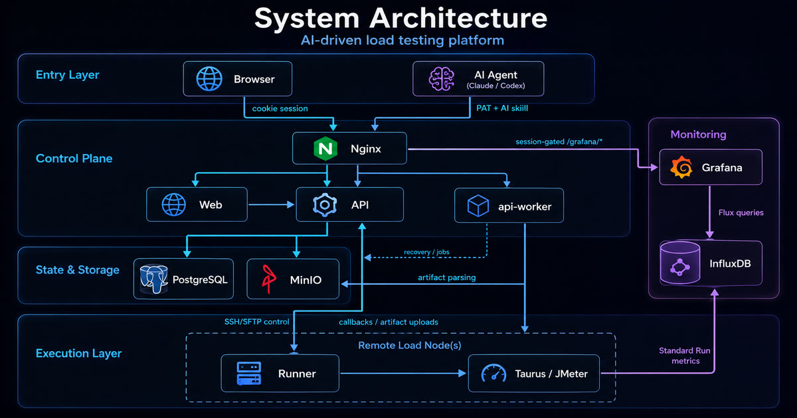

# SurgePilot

**A real distributed system built 100% by AI agents.**

    

English | [简体中文](README.zh-CN.md) | [日本語](README.ja.md)

**[★ Star on GitHub](https://github.com/latentrun/SurgePilot)** · [Public site](https://latentrun.github.io/SurgePilot/) · [Documentation](https://latentrun.github.io/SurgePilot/docs/) · [Releases](https://github.com/latentrun/SurgePilot/releases)

SurgePilot is a self-hosted distributed API load-testing platform—and an inspectable experiment
in whether AI agents can carry a real system from requirements and governance through
architecture, implementation, verification, and release. It turns API and business flows into a
reusable **design → orchestrate → run → report** loop on infrastructure you control.

The original public baseline was built end-to-end by AI agents under human direction. Humans provided
product intent, requirements feedback, product use, and result acceptance; AI agents designed,
implemented, tested, verified, deployed, and released the product.


## Highlights

- ⚡ **One command to self-host SurgePilot.** `surgepilot up` boots Web, API,
  api-worker, PostgreSQL, MinIO, Nginx, Grafana + InfluxDB — no source checkout
  required.
- 🤖 **100% AI-built, end to end.** A complete PRD → SDD → ADR → Slice →
  contracts → tests → deploy lifecycle, all AI-authored and all in this repo.
- 🧭 **Governed, not vibe-coded.** `AGENTS.md`, scope gates, ADRs, and
  contract-first rules keep every change bounded and reviewable.
- 🔒 **Concrete security boundaries.** Workspace isolation, role-based
  admin, encrypted Load Node credentials, and a scoped public REST API.
- 🌐 **Real distributed execution.** The API drives independent Runners on
  remote Load Nodes over SSH, aggregates multi-node results, and streams
  metrics to InfluxDB.
- 🧩 **AI-native infrastructure.** Ships a governed AI skill package so agents
  like Claude and Codex can drive load tests directly — PAT-authenticated,
  Workspace-scoped, with mandatory write confirmation.
- ✅ **Verification is not optional.** `make verify` enforces lint, tests, a
  ≥90% coverage gate, and contract freshness; real SSH end-to-end profiles back
  it up.

## What SurgePilot Does

Performance teams keep running into the same pain points: load scripts are one-off and
hard to reuse, every environment needs reconfiguring from scratch, a single run
means manually wiring up multiple load machines, and results end up scattered
and hard to judge against a target.

SurgePilot collapses that into one reusable, orchestrated, traceable loop. Turn
your API and business flows into reusable test assets you design once and rerun
across environments; orchestrate them with load models and pass/fail criteria;
execute distributed across multiple load nodes; and get a single, authoritative
report with the verdict, key metrics, and artifacts — so you focus on *what to
test and how it did*, not on low-level engine configuration.

And you don't have to click through the UI to do it. SurgePilot integrates with
AI agents: pair it with the bundled AI skill (see below) and tools like Claude
or Codex can drive load tests conversationally — spin up, run, and inspect tests
by asking, through a governed, permission-checked path.

## Built 100% by AI

SurgePilot is a working demonstration of governed, AI-driven engineering — the
opposite of one-shot generation. The entire system was produced through an
explicit, auditable lifecycle:

See [AI authorship details](AI-AUTHORSHIP.md) for the scope of the claim.

| Stage | AI-produced artifact | AI tools used | Evidence in this repo |
|---|---|---|---|
| 1. Product | Product requirements | GPT · Gemini | [`docs/prd`](docs/prd/PRD.md) |
| 2. UI/UX | Frontend interface and experience | Claude · Gemini · Google Stitch | [`apps/web`](apps/web) |
| 3. System design | SDD, scope gates, ADRs, and accepted Slices | GPT · Claude | [`docs/sdd`](docs/sdd/README.md) · [`adr`](docs/sdd/adr/README.md) · [`slices`](docs/sdd/slices/P2-README.md) |
| 4. Implementation | Application code and API contracts | GPT | [`packages/contracts`](packages/contracts) · [`apps`](apps) |
| 5. Verification | Review fixes, tests, and gates | GPT · Claude | [`Makefile`](Makefile) · [testing strategy](docs/sdd/09-testing-and-acceptance-strategy.md) |
| 6. Release | Startup, deployment, and release assets | GPT | [`infra/release`](infra/release) · [workflows](.github/workflows) |

Nothing here is a black box: every stage above links to its actual artifact.
[`AGENTS.md`](AGENTS.md) is the machine-readable contract that made this
repeatable — load the relevant scope before touching code, update contracts
before consumers, respect the API/Runner boundary, and pass the verification
gates. The result is a distributed system you can inspect, reproduce, and
extend, not an ungoverned pile of generated files.

## Architecture

SurgePilot is a **distributed, multi-service system**: a decoupled Web frontend
and API backend, an independent background worker, and load Runners distributed
across remote nodes that generate traffic in parallel and report back over a
documented protocol. (The source lives in a single monorepo, but nothing runs
as a monolith.) Clean, strictly enforced boundaries between these services are
the foundation for its security, reliability, and independent scaling:



## Main Capabilities

Grouped by what an internal platform team actually evaluates. Every item is
backed by checked-in routes, generated contracts, and tests; per-feature usage
belongs in the product documentation rather than this overview.

- **Team isolation & access control.** Multi-team Workspaces with per-Workspace
  data isolation, User Management, and admin/user roles enforced on the backend.
- **Credential & secret security.** Encrypted-at-rest Load Node credentials
  (write-only, never echoed), typed `plain | secret` Env Group variables with
  masked reads, and audit events for sensitive actions.
- **Core testing workflow.** Visual Scenario design, cURL import,
  OpenAPI-operation step drafts, Test Plan orchestration, controlled Run
  execution, Run Reports, Artifacts, and debug HTTP trace.
- **Scale & observability.** Multi-node distributed Run execution with
  aggregated results, plus read-only Monitoring (Grafana + InfluxDB) fed by
  per-node metric streaming.
- **Automation & integration.** A PAT-authenticated, scoped public REST API
  with a generated public OpenAPI artifact, an API Catalog, and a governed AI
  skill package for agent-driven operation.
- **Self-hosted operations.** One-command full-stack startup, contract-first
  architecture, and a ≥90% coverage verification gate.

Availability is governed by the active Slice SDDs and ADRs. This repository does
**not** present inactive roadmap items — such as scheduling, generic
secret-manager integration, editable raw engine config, SSO, or Kubernetes — as
available features.

## AI-Native: Drive SurgePilot From Your Agent

SurgePilot treats AI agents as first-class operators, not an afterthought. It
ships a governed **Public API AI skill package** in the portable `SKILL.md`
format, so coding agents such as **Claude** and **Codex** can operate the
platform through a safe, contract-bound path instead of guessing HTTP calls.

**Get it in one click:** signed-in users open the in-app **Help → AI Agents**
tab and download the ready-to-use skill archive (`surgepilot-public-api-skill.zip`)
straight from the UI — no repository checkout or build step required. Point your
agent at the unzipped folder and it is ready to operate SurgePilot.

The skill wraps the scoped public REST API and its generated OpenAPI contract:

- **Authenticated and scoped.** Calls use a Personal Access Token (PAT) and an
  explicit Workspace; the agent never touches browser sessions, cookies, or
  another Workspace.
- **Safe by default.** Every `POST`/`PATCH`/`DELETE` — including creating or
  stopping a Run — is previewed first and executed only after explicit
  confirmation. The skill fails closed on any undeclared status or field.
- **Contract-bound.** The agent calls allowlisted `operationId`s from the
  bundled OpenAPI contract and never constructs raw URLs.

The archive is built on request by the app and served to your browser; under
the hood it is a repository-maintained source bundle — not an SDK, MCP server,
marketplace, or installer.

## Quick Start

Prerequisites: Docker Engine/Desktop 26 or newer and Docker Compose 2.27 or newer. The installer also needs standard host tools, `curl`, and `tar`.

```bash
curl -fsSL https://github.com/latentrun/SurgePilot/releases/latest/download/install.sh | sh
surgepilot up
```

`surgepilot up` reviews the effective first-run configuration, downloads validated Linux Runtime assets, starts the self-hosted stack, and prints the Web URL. New release deployments keep the Demo Load Node disabled by default, so prepare an external Linux Load Node before starting a Run.

- [Full Quickstart](https://latentrun.github.io/SurgePilot/docs/quickstart)
- [Your First Run](https://latentrun.github.io/SurgePilot/docs/first-run)
- [Configuration Reference](https://latentrun.github.io/SurgePilot/docs/configuration)

### Start from source

For development or a complete local source execution path:

```bash
make setup
make start-full-stack
```

Under the official source startup path, SurgePilot prepares or reuses the native Linux Runtime and starts the Compose-internal Demo Load Node by default. The Demo node must still be registered and initialized in SurgePilot before a Run can select it. The Demo profile can be explicitly disabled through source configuration.

For login, UI, control-plane, and Monitoring review without Runtime or Run readiness, use `make start-preview` instead. See [Startup Modes](https://latentrun.github.io/SurgePilot/docs/startup-modes) for the exact guarantees of each mode.

## Benchmarking New Models With This Repository

Because the full engineering lifecycle is checked in, this repository is a
higher-dimensional benchmark: it evaluates whether a model can rebuild or
extend a multi-service system from real evidence — not just generate
a shallow interface. Give a model a bounded set of PRD, SDD, ADR, Slice,
contract, and test inputs, then compare it on:

- rebuilding the P0 product loop and the resulting `make verify` outcome;
- implementing an accepted, already-supported Slice extension and reviewing the
  contract diff, generated-client freshness, and tests;
- regenerating public OpenAPI and checking that forbidden routes and schemas are
  absent;
- preserving Workspace/security enforcement and the API/Runner protocol
  boundary; and
- avoiding inactive P1/P2 capabilities and forbidden infrastructure.

When the make target and its environment support it, the repository also provides
`make verify-p2-02-public-api-lifecycle` for the Public API lifecycle scenario.

## Documentation

### For users

- [Documentation Home](https://latentrun.github.io/SurgePilot/docs/)
- [Quickstart](https://latentrun.github.io/SurgePilot/docs/quickstart)
- [Startup Modes](https://latentrun.github.io/SurgePilot/docs/startup-modes)
- [Configuration](https://latentrun.github.io/SurgePilot/docs/configuration)
- [Your First Run](https://latentrun.github.io/SurgePilot/docs/first-run)
- [FAQ](https://latentrun.github.io/SurgePilot/docs/faq)

### For contributors and reviewers

- [Contributing Guide](CONTRIBUTING.md) and [Agent Rules](AGENTS.md)
- [SDD Entry Point](docs/sdd/README.md) and [Scope Gate](docs/sdd/00-product-scope-and-priority.md)
- [Architecture Overview](docs/sdd/01-architecture-overview.md) and [Development Workflow](docs/sdd/02-repo-structure-and-dev-workflow.md)
- [API Contracts](docs/sdd/04-api-contract-guidelines.md) and [Runner Protocol](docs/sdd/05-runner-protocol-and-run-state-machine.md)
- [Testing Strategy](docs/sdd/09-testing-and-acceptance-strategy.md)
- [ADR Index](docs/sdd/adr/README.md), [P1 Slice Index](docs/sdd/slices/P1-README.md), and [P2 Slice Index](docs/sdd/slices/P2-README.md)

## Contributing

Read [CONTRIBUTING.md](CONTRIBUTING.md) and [AGENTS.md](AGENTS.md) before opening a change. Contributions may be human- or AI-authored; review is based on the submitted change and repository contracts.

For host-mode development, migrations, contract generation, and verification, follow the [development workflow](docs/sdd/02-repo-structure-and-dev-workflow.md) and the current [`Makefile`](Makefile). Do not infer command behavior from README summaries.

## License

SurgePilot is licensed under the [MIT License](LICENSE).
