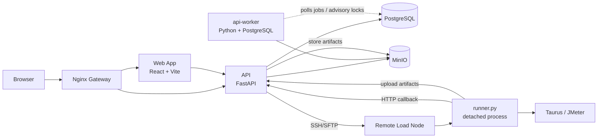

# 01 Architecture Overview

- Document status: Draft
- Project: SurgePilot performance load testing platform
- Document location: `docs/sdd/01-architecture-overview.md`
- Product source: `docs/prd/PRD.md`
- Range constraint: `docs/sdd/00-product-scope-and-priority.md`
- Current delivery target: P0 baseline + accepted P1/P2 slices; ADR-0013 authorizes static Marketing Landing and Logo only

---

## 1. Purpose

This document defines the system architecture boundaries, main component responsibilities, deployment forms, data flows, contract boundaries and prohibited dependencies of SurgePilot P0.

This article is not a detailed implementation design and does not expand on the complete database table, complete API fields, complete Runner state machine, MinIO object key verification details or page interaction details. These should be placed into subsequent Foundation SDD or Slice SDD respectively.

The goal of this article is to let R&D and AI Coding clarify the following before entering the repository skeleton, contracts, and P0 Slice implementation:

1. What components does the system consist of?
2. Boundaries of Web/API/Runner/Load Node/PostgreSQL/MinIO;
3. How to deploy and run P0;
4. Which components can communicate with each other and which components are strictly prohibited from communicating with each other;
5. Which P1/P2 architectural capabilities does P0 not implement?
6. What is the minimum verification entry for P0.

---

## 2. Architecture Principles

The P0 architecture follows the following principles:

1. **P0 only**: Only serves the default Workspace, manual creation, Manual single node execution, and Run Report closed loop.
2. **Don't reinvent the wheel**: Prioritize the use of mature open source frameworks and libraries.
3. **No over-engineering**: No introduction of Kubernetes, Redis, Celery, external message queues, microservice splitting or complex permission systems.
4. **API is the only business status center**: business status, permissions, Workspace, Run status, Load Node status, and artifact metadata are all managed by API.
5. **Web only calls API**: Web does not directly access DB, MinIO or Load Node.
6. **Runner independent**: Runner does not access the API database, does not import API internal code, and only interacts with the API through HTTP callback.
7. **Contracts priority**: Web, API, and Runner collaborate through the contract in `packages/contracts` to avoid guessing the interface.
8. **Workspace-aware from day 1**: P0 only has the default Workspace, but the business data must have `workspace_id`.
9. **MinIO only in P0**: Dependency Files and Run Artifacts only use MinIO.
10. **Manual single-node only**: P0 Each Run can only manually select one Idle Load Node.
11. **P0-Stability is not optional**: Run Snapshot, node lease, callback idempotent, Stop idempotent, heartbeat timeout self-healing and path security must be completed together with P0.

---

## 3. P0 Technology Decisions

| Area | Decision |
| --- | --- |
| Repository | Monorepo |
| Frontend | React + Vite + TypeScript |
| UI Stack | Tailwind CSS + CSS variables + source-owned minimal primitives; see `08-frontend-routing-and-ui-rules.md` |
| Data Fetching | TanStack Query |
| Routing | React Router |
| API Backend | FastAPI |
| Runner | Python 3 `runner.py` |
| Database | PostgreSQL |
| Migrations | Alembic |
| Object Storage | MinIO |
| Deployment | Docker Compose |
| Gateway | Nginx |
| API Style | REST |
| API Contract | FastAPI/Pydantic-generated OpenAPI exported to `packages/contracts` |
| Web Client Generation | `openapi-typescript` + `openapi-fetch` or equivalent approved tool |
| Hand-authored API Types | Forbidden |
| Background Jobs | Separate `api-worker` process, same codebase/image as API |
| Queue System | None in P0 |
| Cache / Lock Service | No Redis in P0 |
| Structured Logging | JSON structured logs using Python stdlib logging + JSON formatter |
| Auth | Cookie-based session |
| CSRF | Session-bound CSRF token for write requests |
| Password Hashing | Argon2id |
| SSH Credential Protection | Encrypted at rest using env-provided encryption key |
| Runner Callback Auth | Internal token from environment variable, sent by `x-runner-token` header |
| Load Node states (P0) | `idle`, `busy`, `offline`, `quarantined` (`quarantined` requires Admin-confirmed residual cleanup, then disable → enable → initialize before reuse) |

---

## 4. High-Level P0 Architecture



Description:

1. Nginx is responsible for routing `/` to the Web and `/api` to the API; ADR-0013 allows the Web to render static Marketing Landing in unauthenticated `/`, and authenticated `/` still enters `/overview`.
2. Web only calls API and does not directly access PostgreSQL, MinIO or Load Node.
3. API is the business status center, responsible for authentication, authorization, Workspace, Run, Load Node, Artifact metadata and object storage access control.
4. The API starts the Runner on the remote Load Node through SSH/SFTP.
5. Runner executes Taurus/JMeter in detached process on Load Node.
6. The Runner reports status and artifacts to the API through HTTP callback.
7. The Runner in P0 does not hold MinIO credentials, and artifacts are written to MinIO through the API.
8. `api-worker` is an independent process, but shares the same code base and image with the API.
9. `api-worker` is not a resource queuing system, nor is it an external queue replacement such as Celery/RQ; it only undertakes the necessary state self-healing and lightweight asynchronous compensation tasks for P0.

---

## 5. Component Responsibilities

| Component | Responsibilities | Must Not Do |
| --- | --- | --- |
| Web | Page rendering, form interaction, calling API, displaying Run Report, automatically refreshing the running page; ADR-0013 static Marketing Landing and Logo rendering | No access to DB; no access to MinIO; no SSH Load Node; no bypassing API permissions; Marketing Landing does not call API or remotely design assets |
| Nginx | Unified entrance, routing Web/API, HTTPS that can be processed by the deployer | Does not carry business logic |
| API | Authentication, authorization, Workspace verification, business CRUD, Run creation, node lease, Runner callback, MinIO transfer, unified error response | Does not rely on the Web; does not implement P1/P2 capabilities; does not bypass contracts |
| api-worker | heartbeat timeout scanning, stop grace compensation, stale lease recovery, artifact summary parsing, lightweight DB job processing, force-kill cleanup execution and quarantine convergence decision-making | Not used as a resource queuing system; does not introduce Celery/Redis; does not undertake HTTP API |
| PostgreSQL | Business data, session, node lease, Run status, artifact metadata, audit events, job table | Not directly accessed by Runner |
| MinIO | Dependency Files and Run Artifacts object storage | Not directly exposed to the web; not abstracted as a non-P0 storage |
| Runner | Receive execution bundle, start Taurus/JMeter, generate logs and artifacts, callback API | Does not access API DB; does not import API internal code; does not determine business status |
| Load Node | Hosts Runner and Taurus/JMeter execution environment | Does not save platform business status |
| packages/contracts | OpenAPI artifact, Web client/types, Runner callback schema | Do not put business logic |

---

## 6. Recommended Repository Structure

```text
.
├── apps/
│   ├── web/
│   │   └── # React + Vite + TypeScript frontend
│   ├── api/
│   │   ├── app/
│   │   │   ├── main.py          # FastAPI entrypoint
│   │   │   ├── worker.py        # api-worker entrypoint
│   │   │   ├── jobs/            # background jobs
│   │   │   ├── models/          # DB models
│   │   │   ├── schemas/         # Pydantic schemas
│   │   │   ├── routes/          # REST routes
│   │   │   └── services/        # business services
│   │   └── tests/
│   └── runner/
│       ├── runner.py
│       └── tests/
│
├── packages/
│   └── contracts/
│       ├── openapi/
│       │   └── api.openapi.json
│       ├── runner/
│       │   └── runner-callback.schema.json
│       └── generated/
│           └── web-client/
│
├── tests/
│   ├── contract/                # OpenAPI and runner callback contract tests
│   └── e2e/                     # Web/API/fake-runner smoke and E2E tests
│
├── infra/
│   └── docker/
│       ├── docker-compose.yml
│       └── nginx/
│
├── docs/
│   ├── prd/
│   └── sdd/
│
├── AGENTS.md
├── Makefile
└── README.md
```

Notes:

1. `api` and `api-worker` use the same codebase and container image.
2. `packages/contracts/openapi/api.openapi.json` is exported from FastAPI/Pydantic.
3. Generated files must not be manually edited.
4. Runner callback schema is versioned with contracts.
5. E2E tests may use fake runner for P0 development, but fake runner does not replace real Runner acceptance.

---

## 7. Deployment Model

P0 uses Docker Compose for single-machine deployment.

Typical P0 services:

```text
web
api
api-worker
postgres
minio
nginx
```

P0 assumptions:

1. Web, API, PostgreSQL, MinIO, Nginx, and api-worker run in the same controlled network.
2. Load Nodes can be remote machines reachable from API by SSH/SFTP.
3. Kubernetes is not supported in P0.
4. HTTPS is handled by an upstream gateway or deployment environment.
5. Docker Compose starts one `api-worker` by default.
6. API may later run multiple replicas behind Nginx, but background jobs remain in `api-worker`, not inside API web processes.

---

## 8. Background Worker Strategy

P0 does **not** run background jobs inside each API web process.

P0 uses a separate `api-worker` process:

```text
api        = FastAPI HTTP server
api-worker = lightweight Python background worker
```

Both use the same codebase and image.

Rationale:

1. P0-Stability requires heartbeat timeout recovery, stop grace compensation and stale lease cleanup.
2. If API web processes later run behind Nginx load balancing, in-process workers would duplicate scans and compete on state transitions.
3. A separate `api-worker` keeps the HTTP server simple while avoiding Celery, Redis or external queues.
4. This is still a simple Python + PostgreSQL architecture, not a resource queue system.

P0 does not introduce:

1. Celery;
2. Redis;
3. RabbitMQ;
4. Kafka;
5. external queue service.

The worker uses PostgreSQL for coordination.

### 8.1 Global Periodic Jobs

Global periodic jobs include:

1. heartbeat timeout scan;
2. stop grace timeout scan;
3. stale node lease recovery.

These jobs must use PostgreSQL advisory locks to avoid duplicate execution if multiple workers are ever started.

Example concept:

```text
try acquire advisory lock
  if acquired:
    run scan
  else:
    skip this tick
```

### 8.2 Object-Level Async Jobs

Object-level jobs include:

1. parse Run report summary;
2. parse `finalstats.csv`;
3. retry artifact summary parsing.

`failed_requests.csv` parsing is deferred to P1 because it depends on a JMeter plugin output contract.

These jobs use a PostgreSQL job table and row-level claiming, for example:

```sql
SELECT *
FROM background_jobs
WHERE status = 'pending'
  AND run_after <= now()
ORDER BY created_at
FOR UPDATE SKIP LOCKED
LIMIT 10;
```

If multiple `api-worker` processes are started in the future, DB locks and job claiming must guarantee idempotency and single processing.

---

## 9. Data and Storage

### 9.1 PostgreSQL

PostgreSQL stores:

1. users and sessions;
2. workspaces;
3. scenarios;
4. env groups;
5. dependency file metadata;
6. test plans;
7. runs and run snapshots;
8. load nodes;
9. node leases;
10. runner callbacks;
11. artifact metadata;
12. report summaries;
13. audit events;
14. background jobs.

P0 uses PostgreSQL transactions, row locks, unique constraints, advisory locks, and `FOR UPDATE SKIP LOCKED` for coordination.

P0 does not require Redis.

### 9.2 MinIO

P0 uses one MinIO bucket:

```text
surgepilot
```

Object prefixes separate asset types:

```text
dependency-files/{workspaceId}/{fileId}/{safeFilename}
run-artifacts/{workspaceId}/{runId}/{relativePath}
```

Rules:

1. Dependency Files and Run Artifacts are stored in MinIO only.
2. Web does not directly access MinIO.
3. API validates permissions, Workspace, references, and path safety before upload/download.
4. Runner does not need MinIO credentials in P0.
5. API controls artifact ingestion into MinIO.
6. Non-MinIO storage is P2 and must not be implemented in P0.

---

## 10. API and Contracts

### 10.1 REST API

P0 API uses REST-style endpoints.

Examples:

```http
GET    /api/scenarios
POST   /api/scenarios
GET    /api/scenarios/{scenarioId}
PATCH  /api/scenarios/{scenarioId}
DELETE /api/scenarios/{scenarioId}
```

Workspace is not included in the route path in P0. Workspace context is resolved from `x-workspace-id` header or the session default Workspace.

### 10.2 OpenAPI Contract

P0 uses FastAPI/Pydantic-generated OpenAPI as the API contract artifact.

Flow:

```text
FastAPI routes + Pydantic schemas
        ↓
export OpenAPI
        ↓
packages/contracts/openapi/api.openapi.json
        ↓
generate Web client/types
```

Rules:

1. Generated OpenAPI artifacts must not be manually edited.
2. Web client/types **MUST** be generated or typed from `packages/contracts/openapi/api.openapi.json`.
3. Recommended tooling: `openapi-typescript` + `openapi-fetch`, or an equivalent approved tool.
4. Root command `make generate-contracts` must export OpenAPI and generate Web client/types.
5. Root command `make verify` must fail if generated contracts are stale.
6. Frontend must not invent API shapes outside contracts.

### 10.3 Unified Error Response

P0 APIs must use a consistent error shape:

```json
{
  "code": "RESOURCE_UNAVAILABLE",
  "message": "The selected node is currently unavailable",
  "requestId": "req_..."
}
```

Rules:

1. `code` is stable and machine-readable.
2. `message` is user-readable.
3. `requestId` is used for troubleshooting.
4. Error code registry is maintained in `docs/sdd/04-api-contract-guidelines.md`.
5. New error codes must be registered before use.

### 10.4 Runner Callback Contract

Runner callback schema is part of `packages/contracts`.

P0 Runner events include:

```text
accepted
running
heartbeat
artifact
finished
failed
aborted
```

Every callback must include at least:

```text
runId
nodeId
eventType
eventTime
message
```

Authentication:

```http
x-runner-token: <internal-token>
```

Rules:

1. Runner token is sent in HTTP header `x-runner-token`, not in body.
2. API must validate `x-runner-token` before processing callback payload.
3. Runner token value must not be returned to Web or written to logs.
4. Runner callback contracts must define required fields and event-specific payloads.
5. Callback field types and ID formats, including `runId` and `nodeId`, are defined in `docs/sdd/05-runner-protocol-and-run-state-machine.md` and `packages/contracts/runner/runner-callback.schema.json`.

---

## 11. Workspace Context

P0 has one default Workspace, but all business data must still be Workspace-aware.

P0 uses header-based Workspace context:

```http
x-workspace-id: <workspaceId>
```

Rules:

1. API routes must not include `workspaceId` in the path.
2. Login or current-user API returns the current default Workspace.
3. Web sends `x-workspace-id` when available.
4. If missing, API may resolve the user's default Workspace in P0.
5. API must validate that the user can access the requested Workspace.
6. Business records must store `workspace_id`.
7. P0 does not implement Workspace switching UI.

---

## 12. Authentication, CSRF and Security

### 12.1 Authentication

P0 uses cookie-based session authentication.

Rules:

1. Session cookie must be `HttpOnly`.
2. Session cookie should use `SameSite=Lax`.
3. `Secure` must be enabled when HTTPS is available in production.
4. Session must have expiration.
5. Logout must invalidate the server-side session.
6. Passwords must be hashed using Argon2id.
7. Plaintext, reversible password storage, and unsalted hashes are forbidden.

### 12.2 CSRF

Because P0 uses cookie sessions, write requests must use simple CSRF protection.

Mechanism:

1. CSRF token is generated by API and bound to the server-side session.
2. Web obtains token from `GET /api/auth/csrf` after login or before first write request.
3. Web sends the token on write requests using `x-csrf-token`.
4. API validates `x-csrf-token` against the current session.
5. `GET`, `HEAD`, and `OPTIONS` do not require CSRF token.
6. `POST`, `PATCH`, `PUT`, and `DELETE` require CSRF token.

### 12.3 SSH Credentials

Load Node SSH passwords and private keys must be encrypted before persistence.

Rules:

1. Encryption key is provided by environment variable.
2. Saved credentials are write-only from UI perspective.
3. Credentials must never be returned in plaintext.
4. Admin must not view or export Private Load Node credentials.

### 12.4 Runner Internal Token

Runner callback internal token is configured by environment variable.

Rules:

1. API validates the token on internal callback endpoints.
2. Runner sends the token as `x-runner-token`.
3. Token value must not be returned to Web.

### 12.5 Sensitive Value Handling

P0 does not implement a full general-purpose sensitive data masking framework. However, P0 must still prevent obvious credential leakage.

Forbidden in API responses, error messages, logs and audit events:

1. Load Node SSH passwords;
2. Load Node private keys;
3. Runner internal token;
4. session cookie values;
5. CSRF token values;
6. password hashes.

---

## 13. P0 Run Execution Flow

P0 Run execution flow:

```text
User clicks Run Now / Debug
  ↓
Web calls API
  ↓
API authenticates user and validates Workspace
  ↓
API validates Test Plan / Scenario / Env Group / Dependency Files / Load Node
  ↓
API creates Run Snapshot
  ↓
API creates Run in Initializing
  ↓
API creates active node lease and marks node Busy
  ↓
API prepares execution bundle
  ↓
API uploads runner.py / bundle / env / dependency files to Load Node by SSH/SFTP
  ↓
API starts runner.py on Load Node
  ↓
Runner spawns detached process
  ↓
Runner callback accepted / running / heartbeat / artifact / finished / failed / aborted
  ↓
API updates Run state according to state machine
  ↓
API stores artifacts in MinIO
  ↓
API enqueues background_jobs(parse_report_summary)
  ↓
api-worker claims job with FOR UPDATE SKIP LOCKED
  ↓
api-worker parses artifacts and writes report summary
  ↓
Run Report shows verdict, KPI, failure preview, final stats, artifacts and nodes
```

Rules:

1. Run Snapshot, Run creation, node lease, and Busy transition must be atomic.
2. Remote SSH/SFTP work must not happen inside the DB transaction.
3. Runner `accepted` does not mean the load test has started.
4. Only `running` means Taurus/JMeter started.
5. Terminal statuses are `Finished`, `Failed`, and `Aborted`.
6. Terminal status must not be overwritten by late callbacks.
7. Stop and callbacks must be idempotent.
8. Heartbeat timeout recovery is handled by `api-worker`.

### 13.1 Stop Path

P0 Stop flow:

```text
User clicks Stop on Initializing / Running Run
  ↓
Web calls API
  ↓
API validates auth, Workspace and Run permission
  ↓
API atomically marks Run as Stopping and records stopRequestedBy / stopRequestedAt
  ↓
API sends stop command to Load Node by SSH:
  runner.py stop --run-id <runId>
  ↓
Runner stops detached process and its child process tree
  ↓
Runner uploads/registers available artifacts
  ↓
Runner callback aborted
  ↓
API marks Run Aborted and releases node lease
```

Rules:

1. Stop API must be idempotent.
2. Repeated Stop requests must not create multiple stop flows.
3. If Runner is unreachable or stop grace period expires, `api-worker` must converge the Run to `Aborted` or `Failed`.
4. Node lease must be released when the Run reaches terminal state.
5. Stopping is not terminal.
6. Detailed transition rules belong to `docs/sdd/05-runner-protocol-and-run-state-machine.md`.

---

## 14. Fake Runner

P0 includes a fake runner for local development and state-machine testing.

Allowed usage:

1. test Run List and Run Report UI;
2. test accepted → running → heartbeat → finished;
3. test failed;
4. test aborted;
5. test heartbeat timeout;
6. test artifact callback;
7. support E2E tests in `tests/e2e`.

Rules:

1. Fake runner is not a substitute for real Runner acceptance.
2. P0 final validation must cover real or near-real Runner protocol behavior.
3. Fake runner must follow the same callback contract as real Runner.

---

## 15. Verification Entrypoint

The repository must provide a single root verification command:

```bash
make verify
```

P0 `make verify` should cover at least:

1. database migration check with Alembic, including upgrade to head or schema/migration consistency check;
2. API lint / format check;
3. API unit tests;
4. Web lint / typecheck;
5. Web unit tests where applicable;
6. Runner unit tests;
7. OpenAPI export check;
8. Web client/types generation freshness check;
9. Runner callback contract tests;
10. API contract tests;
11. smoke or E2E tests using fake runner.

Detailed verification strategy belongs to `docs/sdd/09-testing-and-acceptance-strategy.md`.

Slice Done When must include `make verify` passing, unless the Slice explicitly documents a narrower temporary bootstrap command for M0.

---

## 16. P0 Extension Boundaries

The following are not implemented in P0.

| Capability | P0 Position | Roadmap |
| --- | --- | --- |
| API Catalog | Not in P0 | P1 |
| cURL Import | Not in P0 | P1 |
| Monitoring / Grafana / InfluxDB | Not in P0 | P1 |
| Schedule Run | Not in P0 | P1 |
| Multi-node execution | Not in P0 | P1 |
| Resource Auto allocation | Not in P0 | P1 |
| Workspace Management UI | Not in P0 | P1 |
| User Management UI | Not in P0 | P1 |
| System Settings UI | Not in P0 | P1 |
| Generated YAML preview | Not in P0 | P1 |
| OIDC / SSO | Not in P0 | P2 |
| Secret Env Var | Not in P0 | P2 |
| General sensitive log/error masking framework | Not in P0 | P2 |
| Non-MinIO storage | Not in P0 | P2 |
| Editable Taurus YAML | Not in P0 | Not planned for first version |
| External queue system | Not in P0 | Not planned for P0 |
| Kubernetes | Not in P0 | Not planned for P0 |

P0 may leave extension points only when they do not expose user-visible P1/P2 behavior.

---

## 17. Forbidden Architecture Dependencies

The following dependencies are forbidden in P0:

1. Web → PostgreSQL
2. Web → MinIO
3. Web → Load Node / SSH
4. Runner → PostgreSQL
5. Runner → MinIO direct credentials
6. Runner → API internal code import
7. Runner → Web
8. API → Web
9. Web inventing API shapes outside contracts
10. API storing business objects without Workspace
11. API routes requiring `workspaceId` in path
12. P0 depending on Grafana / InfluxDB
13. P0 depending on Redis / Celery / external queue
14. P0 depending on Kubernetes
15. P0 using non-MinIO object storage
16. P0 exposing Private Load Node credentials in plaintext
17. P0 allowing artifacts or dependency file path traversal
18. P0 logging or echoing SSH credentials, private keys, runner token, session cookie, CSRF token, password, or password hash
19. P0 implementing user-visible API Catalog, Monitoring, Schedule, multi-node, OIDC, Secret or non-MinIO storage behavior
20. P0 implementing user-visible Generated YAML editor or preview UI

---

## 18. Structured Logging

P0 backend logs must be structured JSON logs.

Minimum useful fields:

1. timestamp;
2. level;
3. message;
4. requestId;
5. userId where available;
6. workspaceId where available;
7. runId where applicable;
8. nodeId where applicable;
9. eventType where applicable;
10. durationMs or latencyMs where applicable.

Rules:

1. Ignored or late Runner callbacks must be logged with reason.
2. Run state transitions must be logged.
3. Stop requests and stop convergence must be logged.
4. Credential and token values must never be logged.

---

## 19. Review Checklist

Before accepting architecture or code changes, check:

1. Does it still serve P0 only?
2. Does Web only call API?
3. Is API still the only business state center?
4. Does Runner avoid DB access and API internal imports?
5. Are contracts updated before consumers?
6. Is OpenAPI generated from FastAPI/Pydantic and exported to contracts?
7. Is Web client/type generation refreshed?
8. Does every business object have Workspace context?
9. Is Workspace resolved from header/session rather than route path?
10. Does Run creation atomically create Run Snapshot and node lease?
11. Is manual single-node execution enforced?
12. Are Stop and Runner callbacks idempotent?
13. Can heartbeat timeout be recovered by `api-worker`?
14. Are artifacts and dependency file paths validated?
15. Are Dependency Files and Artifacts stored in MinIO only?
16. Are Private Load Node credentials encrypted and write-only?
17. Are secret-like values excluded from responses, logs and audit events?
18. Does the change avoid Redis, Celery, Kubernetes and external queues?
19. Does the change avoid P1/P2 user-visible functionality?
20. Are migrations present and checked when database schema changes?
21. Does `make verify` or the documented bootstrap verification command pass?

---

## 20. Open Questions for Later SDDs

These questions are intentionally deferred to more specific SDDs:

1. Final Run state transition table and timeout values.
2. Exact node lease table constraints and indexes.
3. Exact Runner callback payload schemas.
4. Execution bundle manifest format.
5. MinIO object key validation details.
6. Artifact retention and remote Run directory cleanup.
7. Report summary parser field mapping.
8. Full API route list and error code registry.
9. Detailed permission matrix.
10. Test strategy and verification commands.
11. Whether to add an ADR documenting the P0 separate `api-worker` decision.
